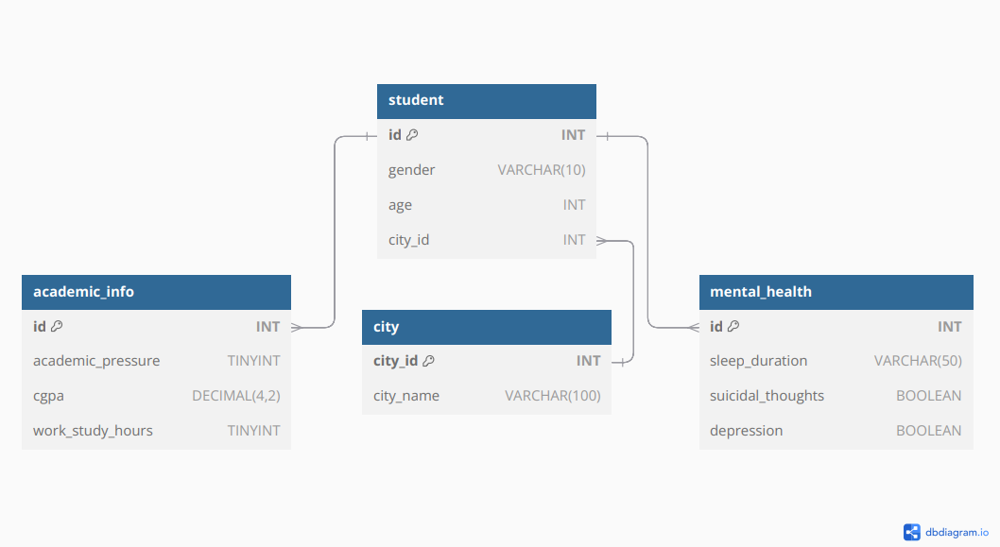
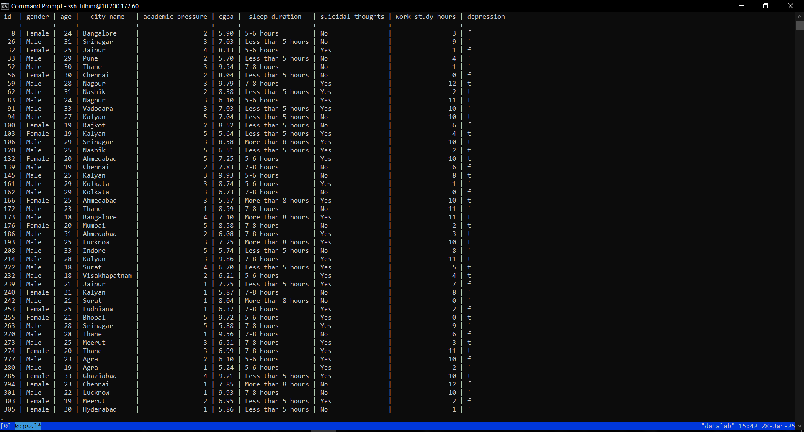
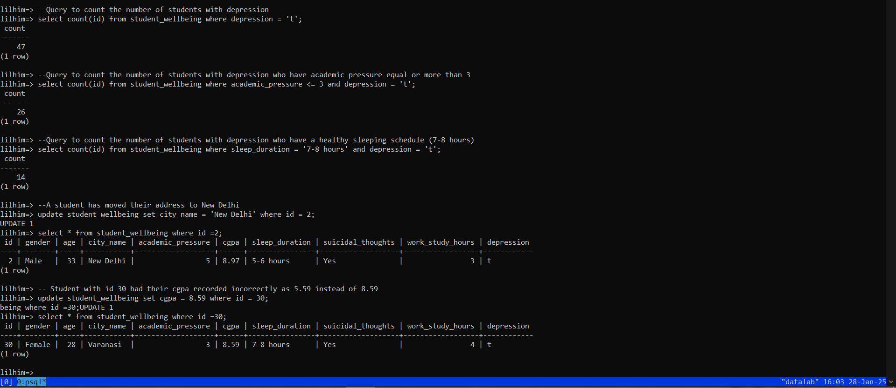

# 🗃️ Student Depression Dataset – Database & Querying (Linux Environment)

## 📁 Project Overview

This project focuses on building a robust **PostgreSQL database architecture** using the **Student Depression Dataset** from Kaggle. The objective was to practice and demonstrate skills in database design, schema creation, ER modeling, Python–PostgreSQL integration, and SQL querying in a **Linux-based environment**.

The project involved setting up a clean relational database, correcting inconsistent data, and writing SQL queries to retrieve meaningful information related to students' depression levels based on multiple demographic and academic factors.

## 🧮 Technologies Used

| Tool/Technology     | Purpose                                              |
|---------------------|------------------------------------------------------|
| **PostgreSQL**      | Database creation and querying                       |
| **Python (psycopg2)** | Connecting to the database and executing SQL commands |
| **Linux Terminal**  | Running and managing services and scripts            |
| **ER Diagram**      | Visualizing the database structure                   |
| **Kaggle Dataset**  | Source data used to populate the database            |

## 🔗 Dataset Link

**Source:** [Kaggle – Student Depression Dataset](https://www.kaggle.com/datasets/hopesb/student-depression-dataset)

## 🧠 Dataset Description

The dataset consists of student demographics and mental health indicators. Each row corresponds to a student, with fields including:

- `ID` – Unique identifier  
- `Gender` – Male/Female  
- `Age`  
- `City`  
- `Academic Pressure` – Scale of 0 to 5  
- `CGPA` – Academic performance  
- `Sleep Duration` – Range of hours  
- `Have you had suicidal thoughts?` – Yes/No  
- `Work/Study Hours`  
- `Depression` – Binary indicator (0/1)  

The data was cleaned and stored in a normalized PostgreSQL table called `student_wellbeing`.

## 🧱 Database Architecture

An Entity-Relationship Diagram was created to model the schema before setting up the database:



The final schema consists of one central table with clearly defined data types and integrity constraints.

## ⚙️ Python Integration (psycopg2)

Python was used to connect to the PostgreSQL database and execute various SQL operations dynamically. Below are some of the key operations:

1. **Display the Dataset**

   The first query is to display the entire dataset, so that all the essential demographic factors can be visualized and studied. 
This is done using the `SELECT *` SQL query. The output is as follows:



2. **Count the Number of Students that have Depression**

   This output helps to get a rough estimate of the total number of students who have reported depression. This helps us understand the impact depression has on students and highlights the need for early intervention. Command used:

   ```python
   cursor.execute("SELECT COUNT(id) FROM student_wellbeing WHERE depression = 't';")
   count_depressed = cursor.fetchone()[0]

3. **Count Students with Academic Pressure greater than or equal to 3 who also experience depression**

   Academic pressure seems like a good demographic factor in influencing depression status. Using this query, we can visualize the count of students experiencing extreme academic pressure along with depression. It can further be compared to the total number of students experiencing depression for more insights. Command used:
   
   ```python
   cursor.execute(
        """
        SELECT COUNT(id) 
        FROM student_wellbeing 
        WHERE academic_pressure >= 3 AND depression = 't';
        """
    )
    count_academic_pressure = cursor.fetchone()[0]

4. **Count Students with healthy sleep schedules who also experience depression**

   A healthy sleep schedule seems like a good indicator of less number of students showing depression. This output is useful in comparing the total number of students who have depression with that of students who have a good sleep schedule between 7-8 hours and still exhibit depression. This output is expected to show a significant contrast between the output from the previous query (academic pressure). Command used:
   
   ```python
    cursor.execute(
        """
        SELECT COUNT(id) 
        FROM student_wellbeing 
        WHERE sleep_duration = '7-8 hours' AND depression = 't';
        """
    )
    count_healthy_sleep = cursor.fetchone()[0]

5. **Update the City Name for a Student**

   This functionality is crucial in error fixing within the dataset. It is important to record the name of the city correctly in order to identify the geographic factor that might play a role in affecting the depression status. With this output, we have reduced the possibility of error in the data analysis process.

   ```python
   cursor.execute(
        """
        UPDATE student_wellbeing 
        SET city_name = 'New Delhi' 
        WHERE id = 2;
        """
    )
    cursor.execute("SELECT * FROM student_wellbeing WHERE id = 2;")
    updated_student = cursor.fetchone()


6. **Update Student CGPA**

   Another factor that is closely related to depression status is the academic result. As student suffering from depression is likely to have a low CGPA on average as compared to a student with no signs of depression. Therefore, we must ensure that the academic CGPA is correctly stored in the dataset. This functionality ensures that any erroneous entries can be carefully updated to represent the correct data.

   ```python
   cursor.execute(
        """
        UPDATE student_wellbeing 
        SET cgpa = 8.59 
        WHERE id = 30;
        """
    )
    cursor.execute("SELECT * FROM student_wellbeing WHERE id = 30;")
    corrected_student = cursor.fetchone()

    The outputs of all other SQL queries are as follows:



## ✅ Conclusion

This project emphasizes backend data operations critical to data engineering and architecture. Even without visualization dashboards, it offers:

- ✅ **Hands-on practice** with PostgreSQL and Python integration  
- ✅ **Strong fundamentals** in database design and querying  
- ✅ **Insightful exploration** of student mental health patterns  
- ✅ A working model that can be extended into more complex **data pipelines** or **analytical dashboards**
